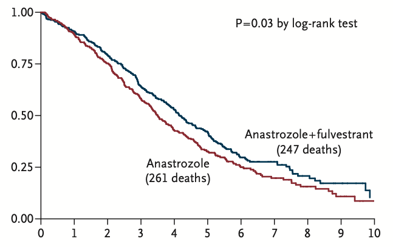

```{r, include = FALSE}
knitr::opts_chunk$set(
  collapse = TRUE,
  comment = "#>",
  eval=TRUE, include=TRUE,
 dev = "png", 
 dev.args = list(type = "cairo-png")
)
```

```{r setup,message = FALSE}
library(SurvdigitizeR)
library(here)
library(ggplot2)
library(jpeg)
library(dplyr)
```

Image to be digitized 



```{r message=FALSE, warning=FALSE}

  out1 <-SurvdigitizeR::survival_digitize(img_path =  here::here("vignettes","KMcurve.png"),num_curves = 2,censoring = F,
                           x_start = 0,x_end = 10,x_increment = 1,y_start = 0,y_increment = 0.25,y_end = 1,y_text_vertical = T)

```

```{r}
out1 %>% 
  ggplot(aes(x = time, y= St, color = as.factor(curve), group = curve)) +
  geom_step() + theme_bw() 
```


