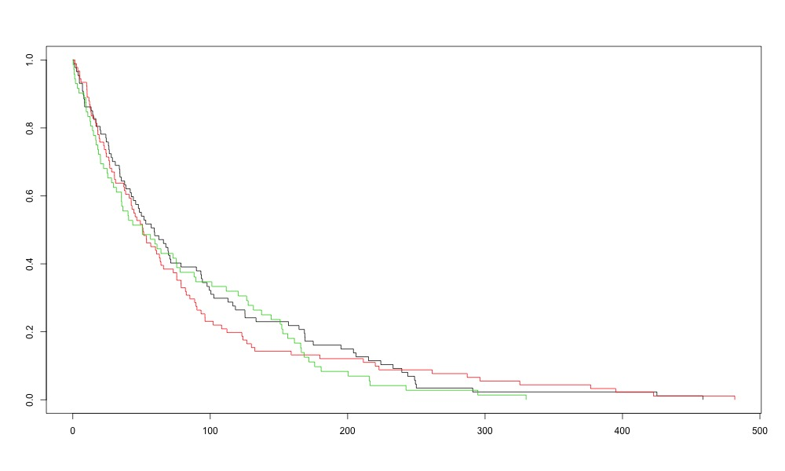

```{r, include = FALSE}
knitr::opts_chunk$set(
  collapse = TRUE,
  comment = "#>",
  eval=FALSE, include=FALSE,
 dev = "png", 
 dev.args = list(type = "cairo-png")
)
```

```{r setup}
library(SurvdigtizeR)
library(here)
library(ggplot2)
```

Image to be digitized 



```{r message=FALSE, warning=FALSE}

  out1 <-survival_digitize(img_path =  here::here("vignettes","FALSE_250_base_3.jpeg"),bg_lightness = 0.3,attempt_OCR = F,word_sensitivity = 30,num_curves = 3,censoring = F,x_start = 0,x_end = 500,x_increment = 100,y_start = 0,y_increment = 0.2,y_end = 1,y_text_vertical = F)
out1 %>% 
  ggplot(aes(x = time, y= St, color = as.factor(curve), group = curve)) +
  geom_step() + theme_bw() 
```
